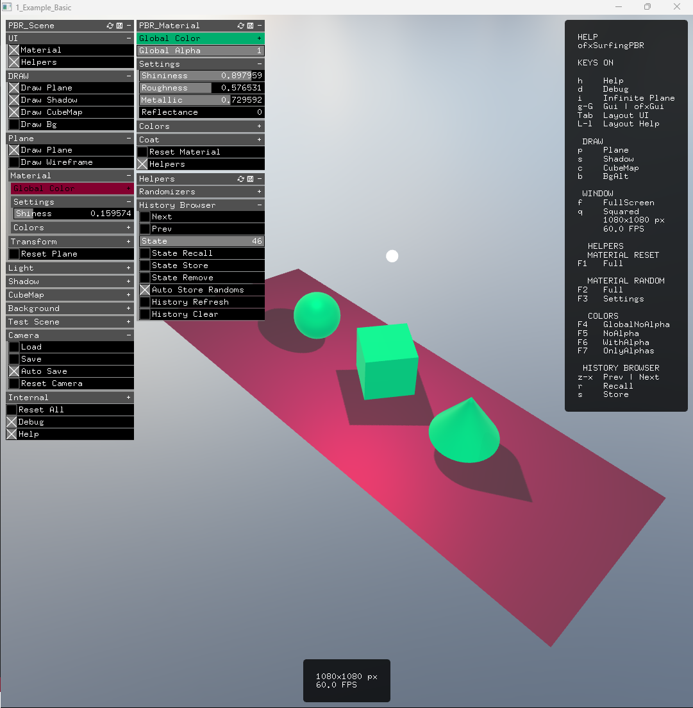

    This example do not includes the main bigger classes from the addon:
    ofxSurfingPBR.h neither the SurfingSceneManager.h.
    These both classes have multiple modules or features included by default,
    (as it could be the CubeMap, the background object, the floor plane...etc)
    Here we want to learn and create a standalone material and a standalone lights combo.
    The material is applied to the floor plane and 
    to the testing three prims scene that we will draw.
    The lights bundled are 4 in total. One of each of the available types into OF core:
    Point, Direct, Spot and Area. All with his settings on a gui to tweak all the internals.
    All of them with all the settings persistent and ready to use on any project.

