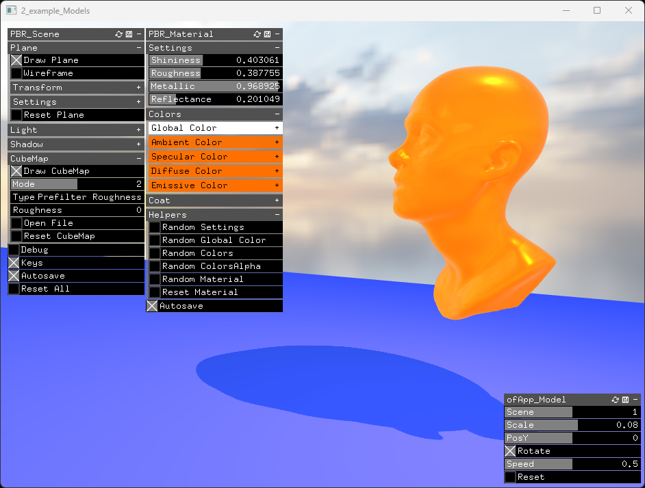

[bin/data.zip](https://mega.nz/file/saMXjATJ#hCcfG5KWJrRnwX85Wy0MmH0JMViaToS1MyOejCIxSZY)

 

This example uses the main class from the `ofxSurfingPBR.h` addon.  
The above class  bundles almost all the modules/features from the addon.  
Many modules can be used as standalone, in a simpler and custom OF scene.  

Also we are using the `SurfingSceneManager.h` class  
how uses also `SurfingModelsFilesBrowser.h`.  
These classes are `3d models` helpers paired with the addon.  
With these classes we can easily browse the `3d models` files  
directly from our app `bin/data/` path.  

As we are using the full addon modules from `ofxSurfingPBR.h`,  
we can render the objects using the bundled materials,  
the plain floor, and all the `4 lights kit`,  
the background generators and the cubeMap.  

 

