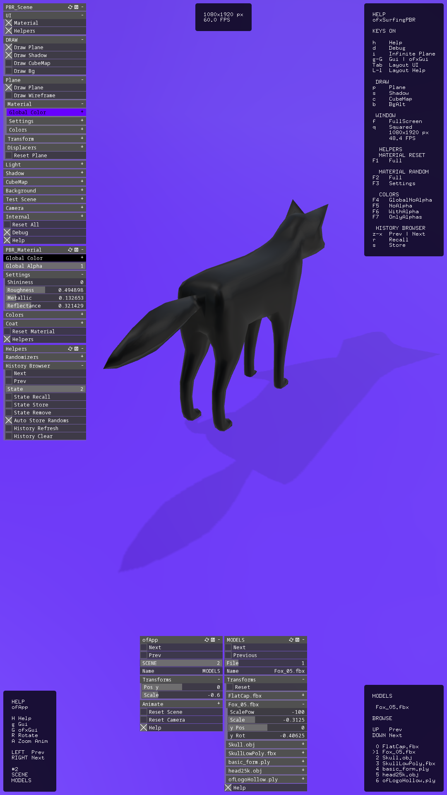

	This example uses the main class from the ofxSurfingPBR.h addon,
	that bundled almost all the modules/features, 
	that they are also included as
	to be used as standalone, in a simpler OF scene.
	Also here in ofApp we using the SurfingModelsManager 
	helpers classes paired with the addon.
	With these classes we can easily browse the 3d model files 
	located on the /data/ path.
	We can render the objects using the bundled materials 
	and all the lights kit, background generators,
	or the plain floor, and the cubeMap.

