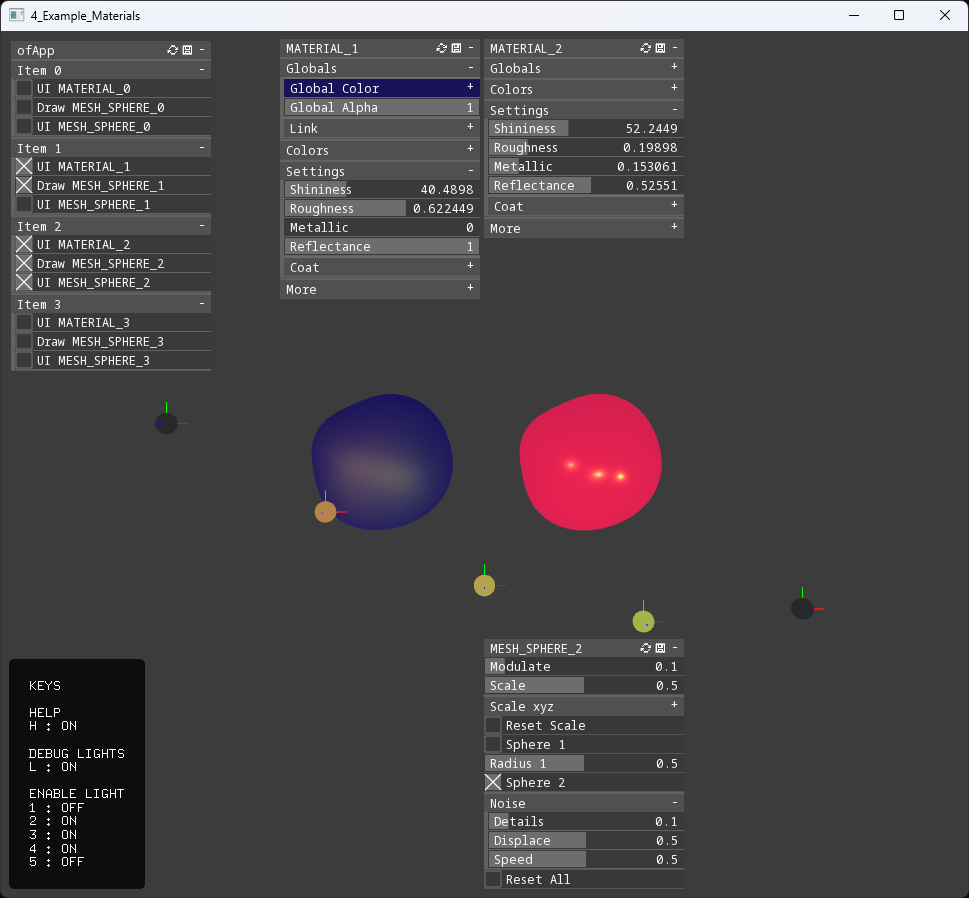

This example uses the internal class `SurfingMaterial.h`.  
We will create a vector of materials to be applied to many objects.  
To draw the object we will use the `SurfingMeshSphereDisplaced.h` class.  
We will have an animated mesh to test the PBR settings on there.  
We will create also some `ofLight`'s from the `OF core`  
to see how the addon can easily mix-up with the core/"vanilla" classes.  

 

