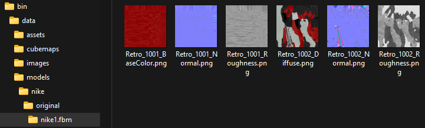

This example shows how to illuminate a loaded FBX model  
with their PBR textures.  
Also, we have a data folder with some parts of the model  
that we exported separately manually  
from Blender, Cinema4D, or any others.  

We will use the `SurfingSceneManager.h` class  
to customize the scene.  
This class auto-creates a combo of the four default lights,  
to perform the light illumination,  
and allows queueing materials and colors to our scene.  
We will create a material for each part,  
so we can tweak each PBR material color and the PBR settings  
for each part independently.  

We have also a rotating camera with height and longitude settings.  
Also, we can apply one single material when using Draw OnePiece.  

