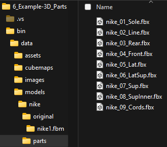

[bin/data.zip](https://mega.nz/file/5Klk0ZZA#nDyOPUj6tvw-g271pFeunr8EA7dBn5juWXZgrJkkOGk)

 

## EXAMPLE DESCRIPTION

This example shows how to illuminate a loaded `FBX model`  
affecting their `PBR texture files`.  
Also, we have a data folder with some parts of the model  
that we exported separately manually  
from Blender, Cinema4D, or any others.  
`bin/data/models/nike/parts/*.*`

We will use the `SurfingSceneManager.h` class to customize the scene.  
This class auto-creates a combo of the four default lights,  
to perform the light illumination,  
	
Also allows queuing materials and colors to our scene.  
We will create a material for each part,  
so we can tweak each PBR material color and the PBR settings  
for each part independently.  

We have also a rotating camera with height and longitude settings.  
Also, we can apply one single aux material when using the floor and on the OnePiece mode.  

 

