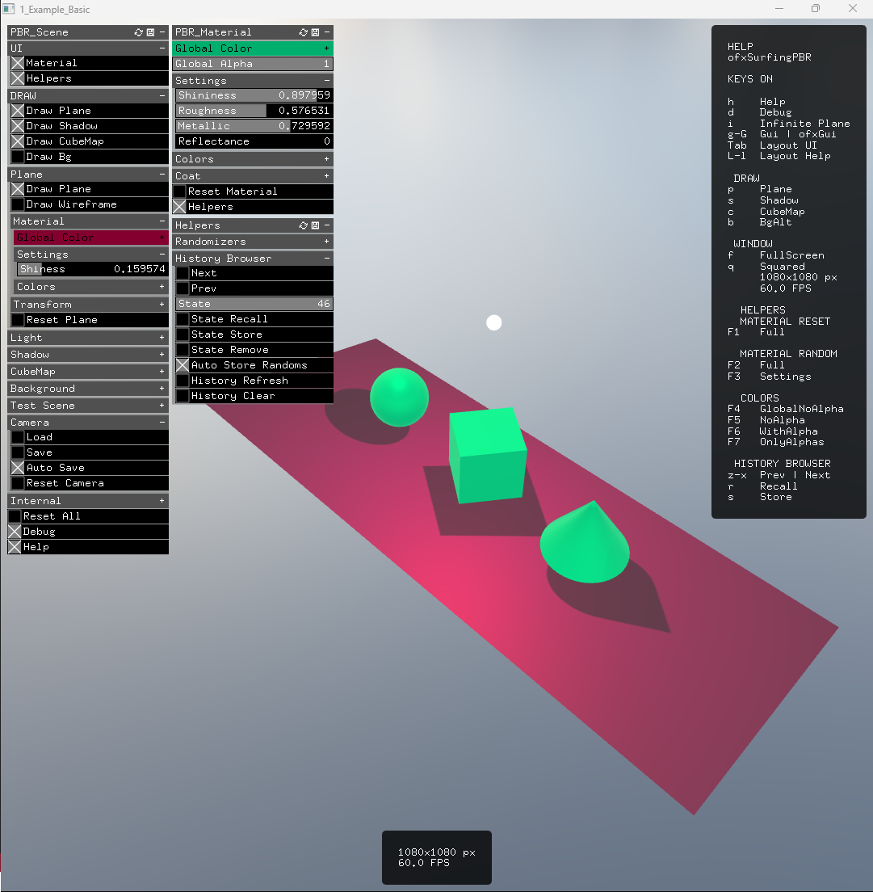
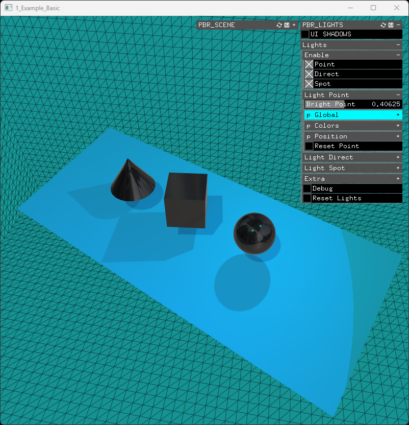
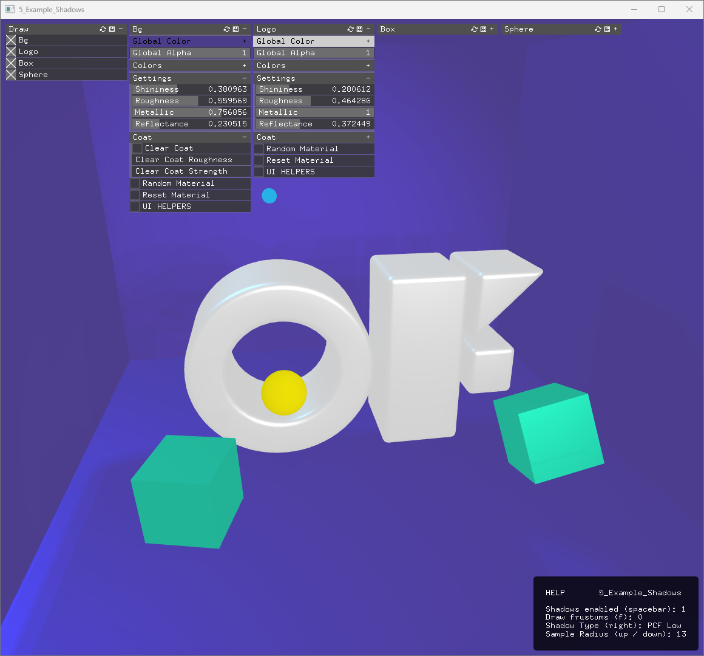
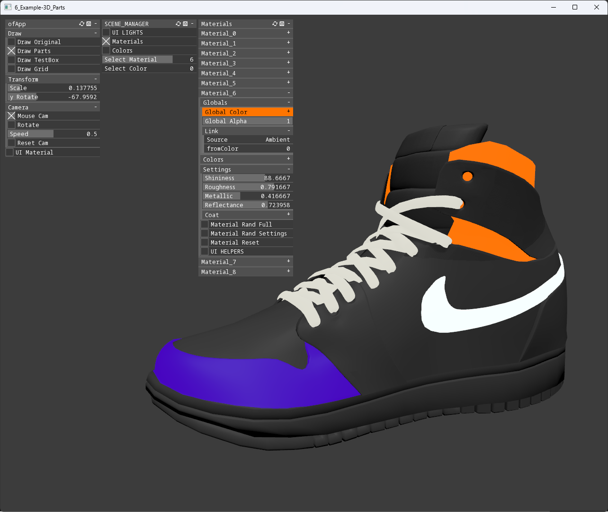
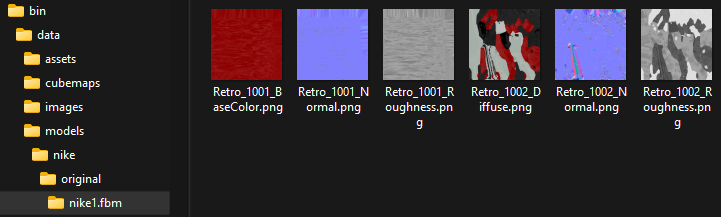
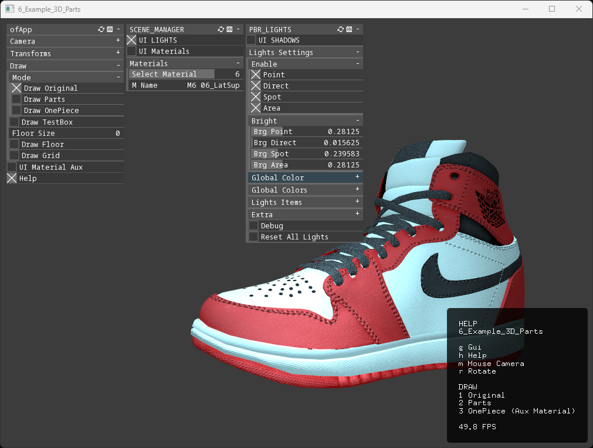
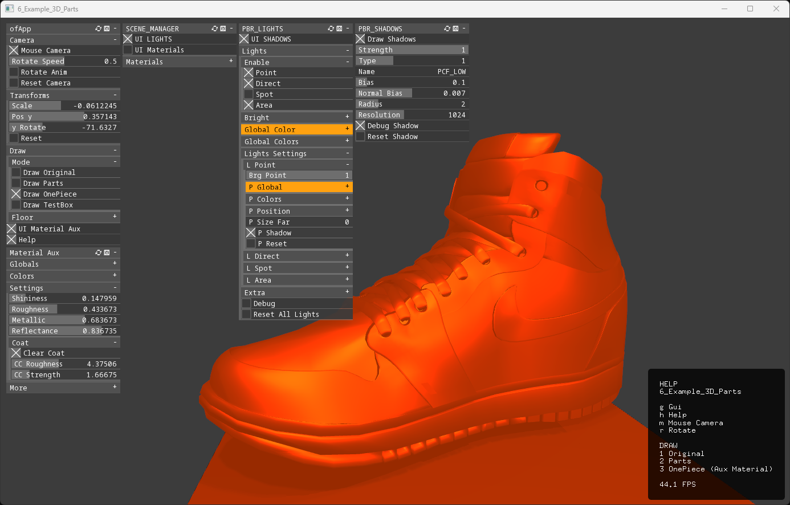

# WIP 

## OVERVIEW

**openFrameworks** addon to easily test, learn, and use the new **PBR features** from the new **OF 0.12+** releases.  

(You should use the [GitHub master branch](https://github.com/openframeworks/openFrameworks)!)  

All this code is copied from and hardly based on this [OF forum topic](https://forum.openframeworks.cc/t/ofshadow-and-ofshader-issue-on-of-0-12/42600/19 ).  
Original authors: [@NickHardeman](https://github.com/NickHardeman) and [@paolo-scoppola](https://github.com/paolo-scoppola).  

## VIDEO

https://github.com/moebiussurfing/ofxSurfingPBR/assets/2106149/43ac19b8-da41-4dd5-ad4d-b77f885d3e24

<details>
  <summary>SCREENSHOTS</summary>
  <p>

### 1_Example_Basic


### 2_Example_Models


### 3_Example_Lights


### 4_Example_Materials


### 5_Example_Shadows

 
### 6_Example-3D_Parts





  </p>
</details>

## FEATURES

- Main class `ofxSurfingPBR.h` is a **Scene Manager** with default common elements:
  - Two ready-to-use editable parametric materials:
    - **Material A**. For the **Plane** (floor).
    - **Material B**. For the **other Objects**.
  - Default **Lights combo**: 
    - Flexible **Point**, **Directional** and **Spot**.
  - **Cubemaps** (**HDR**) files loader.
  - **Background color** and **Sphere/Box container** with material.

- Class `SurfingMaterial.h`: **Standalone Materials** can be used independently of the main class.

- Class `SurfingLights.h`: Four **bundled lights**: `Point`, `Direct`, `Spot` and `Area` with shadows. 

- Class `SurfingSceneManager.h`: Bundles the lights from `SurfingLights.h` and allows **queuing materials** dynamically. Standalone and not loaded by default on `ofxSurfingPBR`.

- Persistent settings:
  - Optimized **auto save** on any change.
  - **Plane** simple material, colors, transforms, snapshots, etc...
  - All materials with full **PBR** specs. 
  - Internal `camera`.

- Material **Randomizers**.
  - **History** browsing workflow.
    - **Presets**/**Snapshots** (Store/Recall) explorer system.
- Included **3D models** browser/loader class.

- Added **Shader** for *testing/code*.
  - **Displacement** applied to the plane and his material/mesh.

### TODO
  - Add more **Shaders** related stuff. / HELP IS WELCOME! 
    - _Mesh/vertex_ displacements (not just heightmaps). / TODO 
    - Shader **Debugger**. / TODO 

<details>
  <summary>USAGE</summary>
  <p>

## EXAMPLE

### main.cpp
```.cpp
#include "ofApp.h"
#include "ofMain.h"

int main() {
    ofGLWindowSettings settings;
    settings.setGLVersion(3, 2);

    auto window = ofCreateWindow(settings);

    ofRunApp(window, make_shared<ofApp>());
    ofRunMainLoop();
}
```

### ofApp.h
```.cpp
#pragma once
#include "ofMain.h"

#include "ofxSurfingPBR.h"

class ofApp : public ofBaseApp {
public:
    void setup();
    void draw();

    ofxSurfingPBR pbr;
    void renderScene();
};
```

### ofApp.cpp
```.cpp
void ofApp::setup() {
    pbr.setup();

    // Pass the render scene function
    callback_t f = std::bind(&ofApp::renderScene, this);
    pbr.setFunctionRenderScene(f);
}

void ofApp::draw() {
    pbr.draw();
    pbr.drawGui();
}

void ofApp::renderScene()
{
    // Plane floor
    pbr.drawPlane();

    // Other objects
    pbr.beginMaterial();
    {
        /* DRAW HERE! */
    }
    pbr.endMaterial();
}
```

  </p>
</details>

## DEPENDENCIES

- [OF 0.12+](https://github.com/openframeworks/openFrameworks).
- [ofxSurfingHelpersLite](https://github.com/moebiussurfing/ofxSurfingHelpersLite).
    - **Helper classes** for settings serializers, auto saver, `ofxGui` customizer, layout helpers, `ofDrawBitmapStringBox`...etc.  
- [ofxSurfingCameraSimple](https://github.com/moebiussurfing/ofxSurfingCameraSimple).
    - An internal improved `ofEasyCam` is bundled.
- **ofxAssimpModelLoader** / _OF core_
    - Only for the example `2_Example_Models`. 

## REQUERIMENTS 
- Download and copy the content of `data.zip` to the examples or to your projects into `/bin/data`:  
  * Data for any or new projects: [bin/data.zip](https://mega.nz/file/cHkylJZY#sVdQpSF8IkvdmKdpMIbA4767kvBvfGL7R7GnU9g20ow)  
  * Data for `2_Example_Models`: [bin/data.zip](https://mega.nz/file/lOMzkJIC#tLaM9MTKA6J83nf0DoxKtoET3uevG-Y6z4_eLfIiIPQ)  
  * Data for `6_Example_3D_Parts`: [bin/data.zip](https://mega.nz/file/VPMBEBTJ#Cgi-u72GdJOMel7xCli2-SmU7aU0b0TtOijyuXIDKdc)  
  * Only shaders: [bin/dataShaders.zip](https://mega.nz/file/gLMwXY6S#HjIfsu80ZIpPccaFbJKowE3qeoRZeK8jnfSrhUEeGQE)
  * Folder with all the files: [@ MEGA](https://mega.nz/folder/RXtC1Qqa#2PfwJf-jIWciE1ZWWu4qfw).
- Notice that all the examples should work without the data files too.

/bin/  
/data/  
/assets/fonts/  ttf,otf | for ofxGui customize  
/cubemaps/  exr,hdr,jpg | for CubeMaps  
/models/  obj,ply,fbx | for 3d objects  
/images/  jpg,png | for Bg sphere texture  
/shadersGL2/  frag,vert | used when enabled  
/shadersGL3/  frag,vert | used when enabled  

## TESTED SYSTEMS
* **Windows 11** / **VS 2022** / **OF 0.12+** @ [GitHub master branch](https://github.com/openframeworks/openFrameworks)

## LICENSE
**MIT License**
