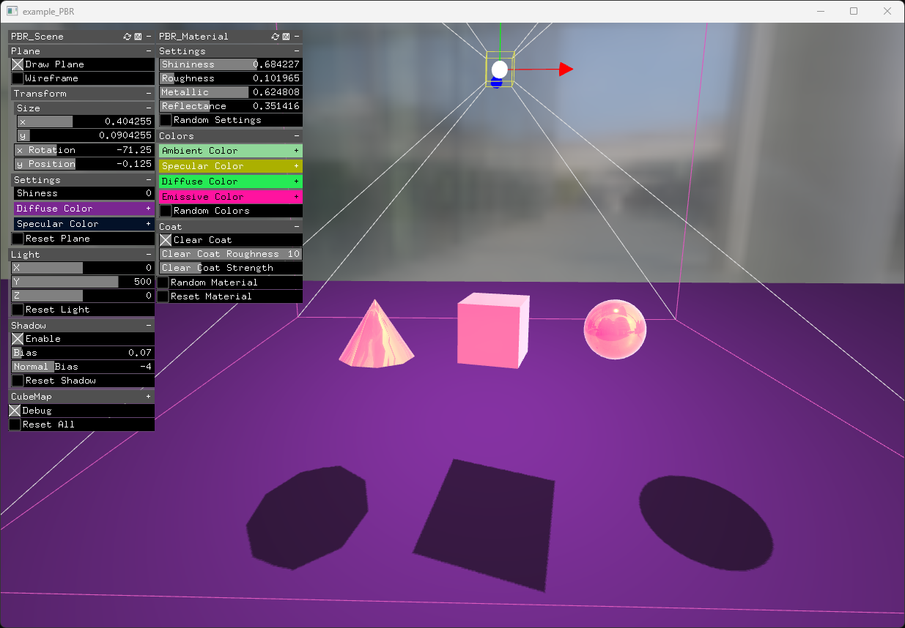

## Overview
**ofxSurfingPBR** is a WIP addon for openFrameworks to easily testing, learn, and use the new PBR features from the new **OF 0.12+** releases.  
(You should use the GitHub master branch.)  

All this code is copied and hardly based on the OF forum topic:  
https://forum.openframeworks.cc/t/ofshadow-and-ofshader-issue-on-of-0-12/42600/19  
authors: @NickHardeman and @Paolo  

## Screenshot

## Features
- Two ready-to-use materials:
  - floor (for the shadows) and other objects.
- A light.
- Persistent settings.
- Easy to pass a local camera and draw your scene.

## Usage
Look at the example.

## Dependencies
* [ofxSurfingHelpers](https://github.com/moebiussurfing/ofxSurfingHelpers) / Only for the example  

## Tested Systems
* **Windows 11** / **VS 2022** / **OF 0.12+**

## License
**MIT License**
